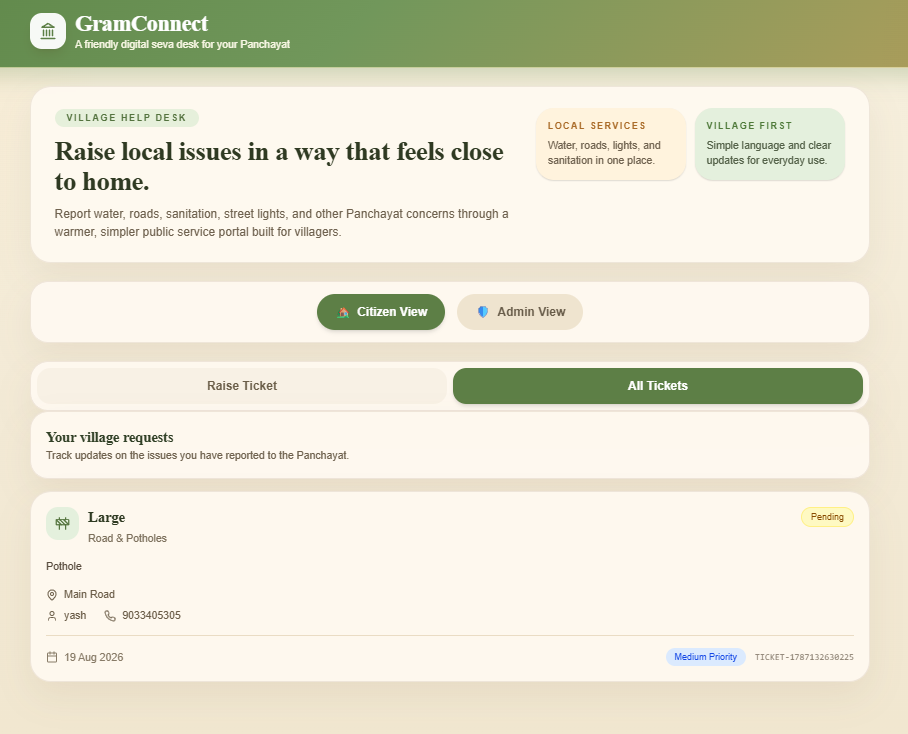
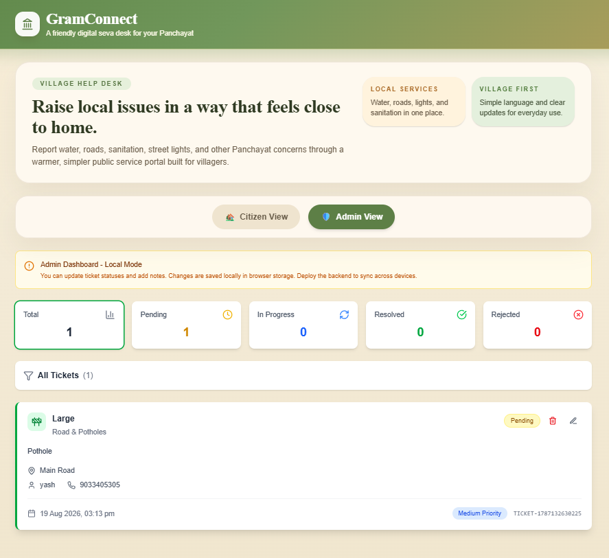

# 🏡 GramConnect

> A warm, village-first digital civic complaint portal ("Seva Desk") for rural India — helping villagers report Panchayat issues and track resolutions.

<p align="center">
  <a href="https://react.dev/"></a>
  <a href="https://tailwindcss.com/"></a>
  <a href="https://aws.amazon.com/"></a>

</p>

<p align="center">
  <a href="#-what-is-gramconnect">About</a> •
  <a href="#-screenshots">Screenshots</a> •
  <a href="#-quick-start">Quick Start</a> •
  <a href="#-using-the-app">Usage</a> •
  <a href="#-project-structure">Structure</a> •
  <a href="#-tech-stack">Tech Stack</a>
</p>

---

## 📖 What is GramConnect?

GramConnect allows Indian villagers to:

- 📝 **Submit complaints** about roads, water supply, electricity, sanitation, street lights, drainage, and more.
- 📸 **Attach photo/video evidence** to their reports.
- 🔍 **Track ticket status** via a floating chatbot (search by Ticket ID or phone number).

Panchayat admins can:

- 📊 **View all submitted tickets** with filtering by status.
- 🔄 **Update ticket status** (Pending → In Progress → Resolved / Rejected).
- 🗒️ **Add admin notes** on each ticket.

---

## 🖼️ Screenshots

<table>
  <tr>
    <td align="center"><b>User Portal</b></td>
    <td align="center"><b>Admin Portal</b></td>
  </tr>
  <tr>
    <td></td>
    <td></td>
  </tr>
</table>

---

## ✅ Prerequisites

Make sure you have the following installed:

| Tool | Minimum Version | Download |
|---|---|---|
| **Node.js** | `>= 18.x` | [nodejs.org](https://nodejs.org/) |
| **npm** | `>= 9.x` (comes with Node) | — |

---

## ⚡ Quick Start

### 1. Clone the project

```bash
git clone https://github.com/yash-raka/GramConnect.git
cd GramConnect
```

### 2. Install dependencies

```bash
npm install
```

### 3. Start the development server

```bash
npm run dev
```

The app will start at **http://localhost:3000** and open automatically in your browser.

---

## 🧰 Running Modes

### Development Server

```bash
npm run dev
```

- Runs Vite dev server on port **3000**
- Hot Module Replacement (HMR) enabled
- Auto-opens browser

### Production Build

```bash
npm run build
```

- Outputs optimized bundle to `./build/`
- Uses `esnext` as the build target

---

## 🏗️ App Architecture

The app runs fully locally out of the box using your browser's local storage:

| Mode | Data Storage | Admin Access |
|---|---|---|
| **Local Mode** 💻 | Browser `localStorage` | Open (No auth required) |

> **Note:** In production, the frontend is hosted on **AWS S3 / CloudFront**, with a backend powered by **AWS Lambda** and **DynamoDB** for scalable cloud storage.

---

## 🧑‍🤝‍🧑 Using the App

### For Villagers (User View)

1. Open the app at `http://localhost:3000`
2. Click the **"Raise Ticket"** tab
3. Fill in your name, phone, issue details, category, location, and optionally attach an image/video
4. Click **"Submit Ticket"**
5. Use the **chatbot** (bottom-right chat bubble) to check your ticket status anytime using your Ticket ID or phone number

### For Admins (Admin View)

1. Click the **"Admin View"** toggle
2. The Admin dashboard is accessible immediately in local mode
3. View ticket stats, filter by status, edit tickets, add notes
4. To **resolve** a ticket: set status to "Resolved" → enter verification code `1234`

---

## 📁 Project Structure

```
GramConnect/
├── src/
│   ├── App.tsx                   # Root component — state, view routing
│   ├── components/                # All UI components
│   │   ├── TicketForm.tsx         # Ticket submission form
│   │   ├── TicketList.tsx         # Ticket list (user view)
│   │   ├── AdminDashboard.tsx     # Admin panel
│   │   ├── AdminTicketCard.tsx    # Ticket editor (admin)
│   │   ├── Chatbot.tsx            # Floating chatbot
│   │   ├── Header.tsx             # App header
│   │   └── ui/                    # shadcn/ui components
│   ├── types/
│   │   └── ticket.ts              # TypeScript type definitions
│   ├── utils/
│   │   └── api.ts                 # All API + localStorage logic
│   └── styles/
│       └── globals.css            # Design system tokens + village theme
```

---

## 🎫 Ticket Statuses

| Status | Color | Meaning |
|---|---|---|
| **Pending** | 🟡 Yellow | Submitted, awaiting admin review |
| **In Progress** | 🔵 Blue | Admin is working on the issue |
| **Resolved** | 🟢 Green | Issue has been fixed |
| **Rejected** | 🔴 Red | Issue was rejected (with admin notes) |

---

## 🛠️ Tech Stack

- **Frontend**: React 18 + TypeScript + Vite 6 + TailwindCSS v4
- **UI Components**: shadcn/ui (Radix UI primitives)
- **Icons**: Lucide React
- **Storage**: Browser `localStorage` (Local Mode)
- **Deployment**: **AWS** (S3, CloudFront, Lambda, DynamoDB)

---

## 📜 License

Created by **Yash Raka**.
Original design inspiration from [Figma](https://www.figma.com/design/sf3QCRR3VKJxBqT6CqHCsB/Ticket-Raising-App).
